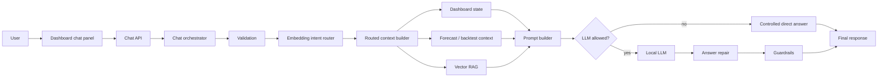
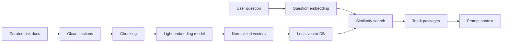
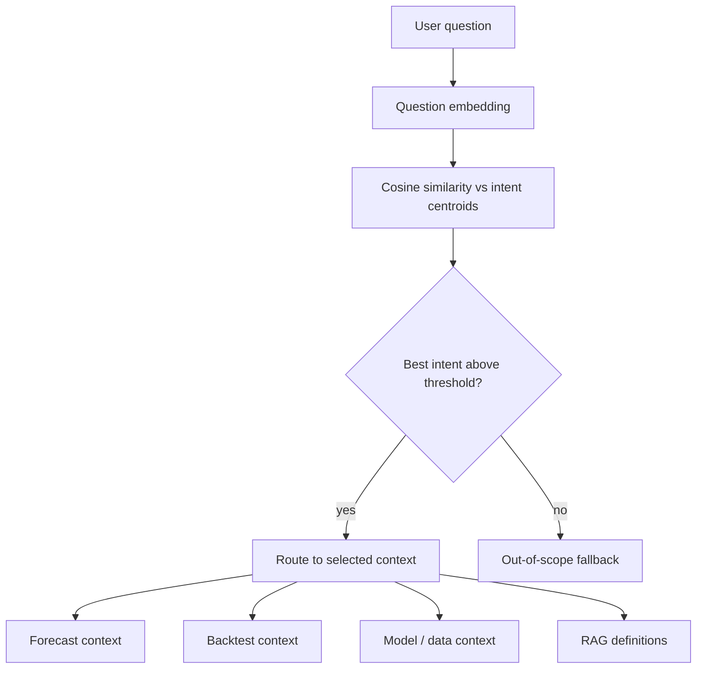
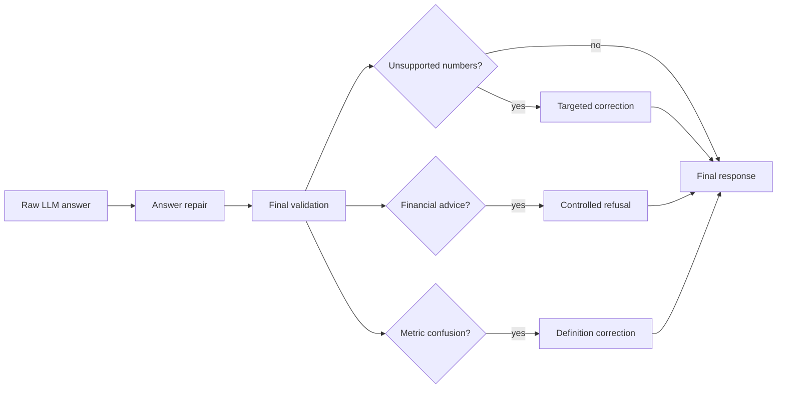

# Architecture Diagrams

## Global Flow

```mermaid
flowchart LR
    A["User"] --> B["Dashboard chat panel"]
    B --> C["Chat API"]
    C --> D["Chat orchestrator"]
    D --> E["Validation"]
    E --> F["Embedding intent router"]
    F --> G["Routed context builder"]
    G --> H["Dashboard state"]
    G --> I["Forecast / backtest context"]
    G --> J["Vector RAG"]
    H --> K["Prompt builder"]
    I --> K
    J --> K
    K --> L{"LLM allowed?"}
    L -- "yes" --> M["Local LLM"]
    L -- "no" --> N["Controlled direct answer"]
    M --> O["Answer repair"]
    O --> P["Guardrails"]
    N --> Q["Final response"]
    P --> Q
```

## Vector RAG

```mermaid
flowchart LR
    A["Curated risk docs"] --> B["Clean sections"]
    B --> C["Chunking"]
    C --> D["Light embedding model"]
    D --> E["Normalized vectors"]
    E --> F["Local vector DB"]
    G["User question"] --> H["Question embedding"]
    H --> I["Similarity search"]
    F --> I
    I --> J["Top-k passages"]
    J --> K["Prompt context"]
```

## Intent Routing

```mermaid
flowchart TD
    A["User question"] --> B["Question embedding"]
    B --> C["Cosine similarity vs intent centroids"]
    C --> D{"Best intent above threshold?"}
    D -- "yes" --> E["Route to selected context"]
    D -- "no" --> F["Out-of-scope fallback"]
    E --> G["Forecast context"]
    E --> H["Backtest context"]
    E --> I["Model / data context"]
    E --> J["RAG definitions"]
```

## Guardrails

```mermaid
flowchart LR
    A["Raw LLM answer"] --> B["Answer repair"]
    B --> C["Final validation"]
    C --> D{"Unsupported numbers?"}
    C --> E{"Financial advice?"}
    C --> F{"Metric confusion?"}
    D -- "yes" --> G["Targeted correction"]
    E -- "yes" --> H["Controlled refusal"]
    F -- "yes" --> I["Definition correction"]
    D -- "no" --> J["Final response"]
    G --> J
    H --> J
    I --> J
```
