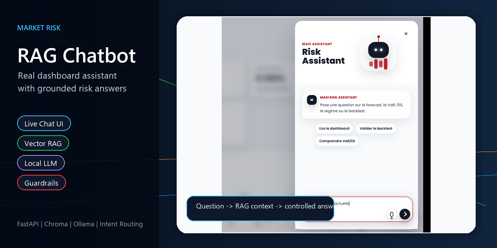

# Market Risk RAG Chatbot

Architecture reference and reference implementation for a controlled local RAG chatbot designed for market risk dashboards.

## Scope

This documentation covers the AI assistant layer:

- FastAPI chat API;
- embedding-based intent routing;
- vector RAG with Chroma;
- dashboard-state grounding;
- prompt construction;
- response policies;
- answer repair and guardrails;
- local LLM integration through Ollama.

## Why It Matters

A generic LLM can hallucinate metrics, confuse VaR and Expected Shortfall, or produce advice that should not be given. This architecture separates routing, retrieval, policy, generation, and validation so the assistant can remain useful and controlled.

## Related Repositories

- Full application: [market-risk-forecasting-ai-dashboard](https://github.com/mohamedzayd-elfahime/market-risk-forecasting-ai-dashboard)
- Research notebooks: [masi-risk-research-notebooks](https://github.com/mohamedzayd-elfahime/masi-risk-research-notebooks)
